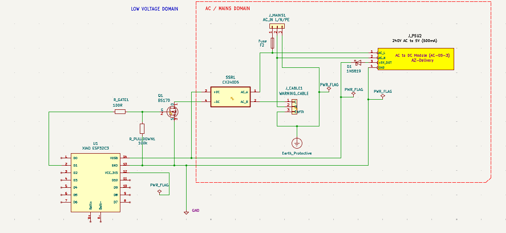

# GH01 Hardware Notes

Initial definition for GH01 prototype hardware.

## Purpose

Control soil temperature in a plant tray by switching a 240V AC soil warming cable on/off based on measured soil temperature.

## Controller

- MCU module: Seeed Studio XIAO ESP32C3
- Reference: https://wiki.seeedstudio.com/XIAO_ESP32C3_Getting_Started/
- Runtime/application model: Espruino JavaScript app using xstate engines from this repository

## Main Components

- Soil temperature sensors: DS18B20 (1-Wire interface), dual-probe support
- Reference air sensor: KeeYees BME280-compatible digital sensor module (BMP280-compatible interface)
  - Used for ambient/reference air temperature, humidity, and barometric pressure sensing/reporting
  - Connected on the shared I2C bus with the OLED display
- Load switch (preferred): Crydom `CX240D5` solid state relay
  - Input: `3-15VDC` (typical `15mA` input current at nominal drive)
  - Output: `12-280VAC`
  - Load class: `5A` (well above GH01 heater load requirement)

## SSR Switching Options (Draft)

GH01 goals for switch choice:
- Keep BOM cost practical.
- Keep build simple with module-based assembly.
- Support long operating life.
- Maintain safe mains switching practice.

### Option 1: Reputable Right-Sized SSR (Preferred)

Typical spec target:
- Output: `12-280VAC` or wider.
- Load class: `5A` (large margin for `27W` heater load).
- Input control: `3-15VDC` or `3-32VDC` type.
- Reputable manufacturer/distributor channel.

Typical device reference:
- [Crydom `CX240D5`](https://cpc.farnell.com/crydom/cx240d5/ssr-5a-240vac/dp/SW03798) (example reputable 5A class SSR)
  - Typical listing values: input `3-15VDC`, output `12-280VAC`, load `5A`
  - Device uses internal opto-isolated input, but GPIO drive-margin still needs to be handled by a driver stage.

Pros:
- Better quality confidence and consistency.
- Better long-term reliability and lower field-failure risk.
- Better traceability/spec clarity for safety review.

Cons:
- Higher unit cost.
- Usually still benefits from a small GPIO driver stage.

### Option 2: Low-Cost Generic SSR Module

Typical profile:
- Very low unit cost.
- Widely available from marketplace vendors.

Pros:
- Lowest upfront BOM cost.
- Simple sourcing and quick prototype availability.

Cons:
- Large variation in real performance/quality.
- Published current ratings may be optimistic.
- Higher risk for long-term and safety-critical mains usage.

### Option Comparison Against GH01 Goals

- Cost: Option 2 wins.
- Simple build: both are simple; Option 1 still straightforward.
- Longevity/reliability: Option 1 wins.
- Safe usage confidence: Option 1 wins.

Interim recommendation:
- Use Option 1 for GH01 baseline build.
- Keep Option 2 as prototype-only fallback where cost is the overriding constraint.

### Implementation (Driver Stage)

Preferred control architecture:
- XIAO GPIO drives a BS170 MOSFET stage.
- Driver stage switches SSR input current from low-voltage supply.
- Do not rely on direct GPIO-to-SSR input drive for final build.
- Note: SSR opto-isolation protects the AC/load side interface; it does not guarantee direct GPIO current-drive margin.

Recommended wiring (BS170 low-side MOSFET driver):
- Driver device: `BS170` (through-hole N-MOSFET, TO-92).
- GPIO path:
  - `XIAO D6 (GPIO21)` -> `R_GATE` (`100R` to `220R`) -> BS170 Gate.
  - BS170 Gate -> `R_PULLDOWN` (`100k`) -> GND (forces OFF during boot/reset).
- Load-switch path:
  - BS170 Source -> GND.
  - BS170 Drain -> SSR input `-` (CX240D5 control negative).
  - SSR input `+` -> `+5V` low-voltage control rail.
- Grounding:
  - XIAO GND, BS170 Source GND, and SSR control return must be common.

Device and value guidance:
- BS170 suitability:
  - Works as a simple low-side switch for the CX240D5 input current class.
  - Keep gate drive and common-ground routing clean for consistent switching.
- `R_GATE` (`100R` to `220R`):
  - Limits edge current/noise into gate and protects GPIO pin during transients.
- `R_PULLDOWN` (`100k`):
  - Keeps gate low if MCU pin is floating at startup.
- Pinout caution:
  - Confirm the actual BS170 pin order from your specific datasheet before build/wiring (TO-92 variants can differ by vendor package view).
- Optional protection (recommended in noisy enclosure):
  - Add small `TVS` or clamp on control rails if switching noise is observed.
- Layout:
  - Keep BS170 and SSR control wiring short.
  - Route MOSFET/SSR control traces away from AC wiring and antenna path.

## User Interface

- Display: 0.96 inch OLED module, 128x64 SSD1306, 4-pin, 3.3V-5V
  - Interface options: I2C/IIC/SPI serial variants (module-dependent)
- Touch inputs:
  - 3 x TTP223 capacitive touch button modules
  - Single-channel, self-locking touch switch sensor type

## Diagnostics

- 2 x dedicated GPIO outputs for external logic analyzer connection
- Intended use: timing/performance testing and trace visibility
- Provide dedicated test points for analyzer hookup:
  - `TP_LA1` on `LA_OUT_1` (`D7` / `GPIO20`)
  - `TP_LA2` on `LA_OUT_2` (`D8` / `GPIO8`)
  - `TP_GND` on digital ground near `TP_LA1`/`TP_LA2`

## Enclosure and Mechanical

- Enclosure with Perspex lid
- OLED positioned for viewing through the lid
- Touch sensors mounted on the inside of the lid with minimal air gap
  - Mounting approach: double-sided tape
  - Activation method: user touch/contact on outside of the lid

## MCU IO Map (Draft)

| Function | Device/Signal | Direction (MCU) | Interface | XIAO Pad | ESP32-C3 GPIO | Notes |
|---|---|---|---|---|---|---|
| Status LED | LED (active-low) | Output | Digital GPIO | D0 | GPIO2 | Strap pin, must be HIGH at boot; wire LED anode to 3.3V and cathode via resistor to D0 |
| Touch input 1 | TTP223 #1 OUT | Input | Digital GPIO | D1 | GPIO3 | Through-lid capacitive touch input |
| Soil temperature bus | DS18B20 #1 / DS18B20 #2 DQ | Input | 1-Wire | D2 | GPIO4 | Shared 1-Wire bus, 4.7k pull-up to 3.3V |
| Touch input 2 | TTP223 #2 OUT | Input | Digital GPIO | D3 | GPIO5 | Through-lid capacitive touch input |
| I2C bus SDA | OLED SSD1306 + BME280 SDA | Bidirectional | I2C | D4 | GPIO6 | Shared I2C data line |
| I2C bus SCL | OLED SSD1306 + BME280 SCL | Output/Clock | I2C | D5 | GPIO7 | Shared I2C clock line |
| Heater control | Driver stage input (to SSR control) | Output | Digital GPIO | D6 | GPIO21 | Drive BS170 MOSFET stage; keep OFF by default at boot with gate pulldown |
| Logic analyzer ch1 | LA_OUT_1 | Output | Digital GPIO | D7 | GPIO20 | Timing/performance instrumentation (`TP_LA1`) |
| Logic analyzer ch2 | LA_OUT_2 | Output | Digital GPIO | D8 | GPIO8 | Strap-related caution: keep HIGH at boot when D9 is LOW (`TP_LA2`) |
| Boot strap / recovery | Boot switch | Input | Boot strap | D9 | GPIO9 | Handled on XIAO module (onboard button/pull-up); no external button or pull-up required |
| Touch input 3 | TTP223 #3 OUT | Input | Digital GPIO | D10 | GPIO10 | Through-lid capacitive touch input |

### KiCad V2 MCU Wiring Snapshot (Current)

This table records what is currently wired in `GH01_low_voltage_01` from exported netlist, so design intent and schematic state can be compared quickly.

| Signal Path | Design Intent (`GH01_hardware.md`) | Current KiCad V2 Netlist | Status |
|---|---|---|---|
| Heater control GPIO to gate resistor | `U1:D6 (GPIO21) -> R_GATE1:1` | `U1:D6 -> R_GATE1:1` | Pass |
| Gate resistor to MOSFET gate | `R_GATE1:2 -> Q2:G` | `R_GATE1:2 -> Q2:2 (G)` | Pass |
| Gate pulldown | `Q2:G -> R_PULLDOWN1:1 -> GND` | `Q2:2 (G) -> R_PULLDOWN1:1 -> GND` | Pass |
| MOSFET source reference | `Q2:S -> GND` | `Q2:3 (S) -> GND` | Pass |
| MOSFET drain to board interface control line | `Q2:D -> J2:SSR_CONTROL` | `Q2:1 (D) -> J2:3 (SSR_CONTROL)` | Pass |
| XIAO 5V input feed via interface | `J2:+5V_OUT -> U1:VUSB` | `J2:1 (+5V_OUT) -> U1:14 (VUSB)` | Pass |
| Logic analyzer test point 1 | `U1:D7 (GPIO20) -> TP_LA1` | `U1:8 (D7_GPIO_20) -> TP1` | Pass |
| Logic analyzer test point 2 | `U1:D8 (GPIO8) -> TP_LA2` | `U1:9 (D8_GPIO_08) -> TP2` | Pass |
| Logic analyzer ground test point | `GND -> TP_GND` | `/GND -> TP3` | Pass |

Note:
- Current netlist now aligns with design intent for heater-control GPIO (`D6`).

### Wiring Notes (Boot Safety)

- `D0/GPIO2` is a strapping pin and must be HIGH at boot.
- `D8/GPIO8` and `D9/GPIO9` are strapping-related pins; avoid external loads that pull them LOW during boot unless intentionally forcing flash mode.
- `D9/GPIO9` boot/recovery components are provided on the XIAO module; do not duplicate with external pull-up/switch unless a specific remote-access requirement is added.
- Ensure common GND between XIAO and logic analyzer for valid pulse capture (use `TP_GND`).
- Confirm I2C pull-ups are present on the OLED/BME280 bus.

### DS18B20 Dual-Probe Naming

To support multiple soil probes on one 1-Wire bus, use two connectors and fixed names in both schematic and software mapping:

- `J4` -> `SOIL_TEMP_1` (primary probe, default control probe)
- `J5` -> `SOIL_TEMP_2` (secondary probe, optional monitor/reference)

Signal naming recommendation:

- Bus net: `ONEWIRE_SOIL`
- Device IDs in software: `soil_temp_1`, `soil_temp_2`

## Power Supply Architecture (Draft)

Target concept: one incoming `240V AC` supply cable feeds both heater control and low-voltage electronics.

### Proposed Topology

- Incoming `240V AC` enters enclosure via dedicated mains entry/strain relief.
- AC branch A: to SSR load side for soil heater cable switching.
- AC branch B: to isolated AC-DC module providing low-voltage DC for control electronics.
- Selected low-voltage path: `5V` AC-DC module output to XIAO power input path (`VIN`/5V rail as implemented).
- XIAO `3.3V` rail powers low-power peripherals (DS18B20, BME280, OLED, TTP223 modules).

### Candidate AC-DC Module (Current Discussion)

- Candidate family: AZ-Delivery Mini power supply modules.
- Preferred variant for this architecture: `AC-05-3` (nominal `5V`, rated `600 mA`, `3W` class).
- Input range (from copied module data): `100-240V AC`, `48-62Hz`.
- Reference summary table: `misc/240Vto5VPowerModule.md`

### Integration Notes

- Keep mains and low-voltage zones physically separated inside enclosure.
- Keep SSR/mains routing away from antenna, I2C lines, and sensor wiring.
- Use common low-voltage GND reference for MCU, sensors, display, touch inputs, and SSR control side.
- Apply mains-side protection and termination suitable for enclosure use (fuse/protected entry/strain relief).
- Follow Seeed guidance when feeding 5V externally: include diode isolation to prevent backfeed.

### Mains Fuse Specification (Preferred)

For GH01 prototype v1, use a replaceable mains fuse on the incoming Live (`L`) conductor:
- Fuse type: time-delay (`T`, slow-blow)
- Preferred rating: `T250mA`
- Alternate rating (if nuisance trips during start-up): `T315mA`
- Voltage rating: `250VAC`
- Format: `5x20mm` cartridge
- Construction: ceramic / high breaking capacity (HBC) preferred

Preferred mechanical implementation:
- Panel-mount replaceable fuse holder in the enclosure.
- Wire `L_IN -> fuse holder -> L_FUSED_OUT` before SSR load path.
- Candidate part reference: Multicomp Pro `CFH05` panel fuse holder, `5x20mm`
  - CPC: `FF03722`
  - Link: `https://cpc.farnell.com/multicomp-pro/cfh05/fuse-holder-screw-cap-20x5mm/dp/FF03722`

Schematic/PCB note:
- For current design stage, model the fuse path in schematic and use connector/wiring points as needed.
- Final PCB footprint selection can be deferred; if panel mount is retained, PCB fuse footprint is optional.

### External 5V Diode Isolation (Implementation Instruction)

Required connection (single diode method):
- AC-DC module `+5V OUT` -> diode **anode**
- Diode **cathode** -> XIAO `5V/VUSB` node
- AC-DC module `0V/GND` -> XIAO `GND`

Power-path clarification:
- External PSU power to XIAO is intentionally routed **through this series diode**.
- `VUSB` is a shared 5V node (USB side and external supply side meet at this node).
- With diode fitted in the external feed, backflow from `VUSB` into the AC-DC output is blocked.

Recommended diode type:
- Schottky diode, low forward-drop, `>=1A` continuous rating.
- Practical example class: `SS14` (`1A`, `40V`, SMD).

Orientation check:
- Marked stripe/band on diode body is the **cathode** (connect this side to XIAO `5V/VUSB`).
- This orientation allows external PSU to power XIAO while blocking reverse current toward the PSU/USB side.

Design note:
- Account for Schottky voltage drop in power budget; verify actual XIAO input voltage under load.

### Decision Status (Power)

Decided defaults for GH01 prototype v1:
- `A` External PSU output: use `5V` module (`AC-05-3` candidate).
- `B` XIAO feed path: use `VUSB/5V` path for first bring-up (not `VIN`) with series Schottky isolation diode per section above.
- `C` `3.3V` rail usage: low-power peripherals only (DS18B20/BME280/OLED/TTP223).
- `D` SSR control drive: prefer transistor/MOSFET driver stage over direct GPIO.
- `E` Service/debug rule: avoid simultaneous ambiguous dual-power states (`USB + external 5V`) until validated.

Still open before final design freeze:
- Confirm measured `3.3V` current and regulator temperature at worst-case load.
- Confirm USB + external 5V coexistence behavior and define final allowed service mode.
- Confirm final mains suppression details (MOV/snubber choices) and terminal hardware selection.
- Confirm physical AC/LV partition distances in final enclosure layout.

### KiCad Connectivity Review, Findings, Advice and Decisions (Draft)

Source files (moved location):
- `hardware/XIAO_ESP32C3_kicad/02 XIAO ESP32-C3.kicad_sch`
- `hardware/XIAO_ESP32C3_kicad/XIAO ESP32C3_v1.3.kicad_sch`

Key schematic evidence captured:
- Power nets present: `USB_FUSED_5V`, `VUSB`, `VIN`, `VBAT`, `VCC_3V3`.
- PMIC/rails parts present:
  - Charger: `PMIC-XC6802MR`
  - LDO: `TLV75733PDBVR`
  - Power-path PMOS: `LP0404N3T5G`
- Header reference with exposed rails/signals: `J2`.

Connectivity findings summary:
- `VUSB`, `VIN`, `VBAT`, and `VCC_3V3` are distinct named rails in the design.
- USB-side fused 5V exists (`USB_FUSED_5V`) and is part of the board power architecture.
- The board includes charger + PMOS + LDO power-path logic, so external 5V injection choice affects USB coexistence behavior.

Implementation advice for GH01:
- Use isolated external `5V` module as planned and keep all GH01 controls/sensors on low-voltage side.
- Keep AC domain and low-voltage domain physically partitioned in enclosure.
- Keep SSR control on low-voltage side with clean common GND reference.
- Treat simultaneous external 5V + USB connection as a controlled service case (do not assume always-safe without test confirmation).

Decision and validation status is defined in `Decision Status (Power)` above.

## Antenna Arrangements (Draft)

This draft summarizes antenna options for the Seeed XIAO ESP32-C3 in the GH01 enclosure.

### 1) Standard Option: FPC Flexible Antenna (Supplied with Board)

- Standard offering: Seeed 2.4 GHz FPC antenna supplied/package option for XIAO ESP32-C3.
- Type: Flexible Printed Circuit (FPC) antenna with PCB radiator structure.
- Connector/interface: U.FL to board RF connector.
- Nominal impedance: 50 ohm.
- Typical antenna size: 20 x 40 mm.
- Operating band: 2400-2500 MHz (2.4 GHz ISM).
- Protocol support context: Wi-Fi 802.11b/g/n and Bluetooth BLE (2.4 GHz only, not 5 GHz).
- Typical peak gain: up to about 2.9 dBi.
- Polarization: linear.

### 2) FPC Fitting for Best Performance in Perspex Enclosure

- Perspex/acrylic is generally RF-transparent enough for practical 2.4 GHz use.
- Main risk is detuning from close dielectric loading, not severe bulk attenuation.
- Keep an air gap between antenna and enclosure wall: target 3-5 mm minimum.
- Place near an outer edge/corner of enclosure to reduce obstruction by internal assemblies.
- Keep clearance from metal parts and noisy assemblies: target 10-20 mm minimum from screws, large metal masses, display metalwork, battery cans, etc.
- Test orientation in-situ (vertical/horizontal) because FPC radiation is not perfectly omnidirectional.
- Keep antenna-zone wall section thin where possible: around <=2.5 mm preferred.
- Avoid conductive/loaded plastics in RF path (carbon/metal-filled or metallic-finish plastics).
- Mechanically secure the FPC (e.g., quality double-sided adhesive) to prevent movement-based detuning drift.
- Keep a simple RF keep-out area around the antenna and its short feed cable:
  - no relay wiring runs
  - no mains cable runs
  - no dense cable bundles crossing the antenna area

### 3) Optional External Pigtail + Rod Antenna Alternative

- Alternative arrangement: external 2.4 GHz rod/dipole antenna mounted outside enclosure.
- Typical interconnect: U.FL to SMA or RP-SMA pigtail, with bulkhead connector through Perspex wall.
- Typical rod antenna gain range: about 3-6 dBi.

Typical advantages:
- Better range/sensitivity than stock FPC in many installs (often improved link margin).
- Avoids enclosure/internal component detuning effects by moving radiator outside box.
- More predictable broad horizontal coverage when mounted vertical (omnidirectional donut pattern).

Typical trade-offs:
- Pigtail insertion loss (commonly ~0.1-0.5 dB depending on cable quality/length).
- Extra mechanical parts and weather/mechanical exposure for external antenna.

Fitting guidance for optimal performance:
- Keep pigtail as short as practical.
- Use correct connector polarity/type end-to-end (SMA vs RP-SMA).
- Mount bulkhead firmly with strain relief and bend-radius protection on pigtail.
- Keep rod antenna clear of nearby metal surfaces for stable radiation pattern.
- Preferred orientation: mount rod vertical when you want broad horizontal coverage.
- Validate final RSSI/packet reliability in intended install position before freezing mechanical design.

### 4) Practical Selection Guide (GH01)

- Start with the supplied FPC antenna for first prototype builds.
- Move to external pigtail + rod if range is weak, reconnects are frequent, or signal drops once the enclosure is fully assembled.
- Keep antenna wiring and antenna position away from SSR area and mains cable routing.
- Keep the antenna area clear of large metal items, bracketry, and dense cable bundles.
- Avoid frequent disconnect/reconnect of the small U.FL connector; secure cables to prevent pull or vibration stress.
- For FPC installs, test two or three physical orientations and keep the best measured result.

### 5) Simple Validation Checklist (Before Build Freeze)

- Measure and record RSSI at 3 fixed locations around the target install area.
- Run a 30-60 minute stability test and log disconnect/reconnect events.
- Check behavior with all high-noise loads active (SSR switching, display updates, sensor reads).
- Compare two final mechanical options (internal FPC vs external rod) using the same test points.
- Run one quick coexistence check with both Wi-Fi and BLE active.
- Lock antenna placement/orientation only after repeatable results are achieved.
- Use region-appropriate 2.4 GHz antenna parts consistent with product compliance requirements.

### 6) Recommended Mechanical Mounting Recipe (FPC Inside Lid)

Assumption: SSR area is locally managed per `SSR EMI Control (Draft)` below.

Recommended layer stack (inside to outside):
- FPC antenna fixed to a thin non-conductive backing plate using supplied 3M tape.
- Air-gap support option A: spacer frame around antenna perimeter to hold stand-off.
- Air-gap support option B: low-density non-conductive foam spacer (kept mainly to perimeter where possible).
- Inside face of Perspex lid.

Practical materials:
- Backing plate: PET, polycarbonate, or acrylic sheet.
- Backing plate thickness: 0.5-1.0 mm (up to 1.5 mm acceptable if layout demands it).
- Air-gap support:
  - Option A: non-conductive spacer frame/tape, 3-5 mm thickness.
  - Option B: low-density non-conductive closed-cell foam, 3-5 mm thickness.
- Adhesive: stable double-sided tape suitable for enclosure temperatures.

Placement and fixing rules:
- Keep the active antenna face mostly over an air gap; avoid full-surface solid pads directly against it.
- If foam is used, prefer low-density non-conductive closed-cell foam and use perimeter support where possible.
- Keep the antenna assembly close to enclosure edge, away from SSR/mains compartment and heavy cable bundles.
- Keep metal fasteners/brackets out of the antenna near-field zone.
- Add strain relief so the U.FL lead cannot pull on the antenna during vibration or service.
- Mark final orientation after testing to avoid accidental reassembly changes.

## SSR EMI Control (Draft)

Use a combined approach: separation + shielding + suppression.

### Physical Separation and Routing

- Keep SSR and 240V AC wiring in a dedicated enclosure zone away from RF/sensor wiring.
- Keep AC live/neutral runs short and close together; avoid running them alongside antenna or I2C/sensor wires.
- Keep low-voltage control wiring to the SSR short and direct.

### Shielding Approach

- If extra isolation is needed, use a grounded metal partition between SSR/AC area and low-voltage electronics.
- Practical material: aluminum or copper sheet.
- Practical thickness: about 0.5-1.0 mm.
- Do not place shielding metal near the antenna mounting zone.

### Source Suppression

- Add noise-control parts on the heater/SSR AC side where needed (for example RC snubber and/or MOV; check correct type and rating for your setup).
- If switching noise is still present, fit ferrite clamp(s) on the AC wires close to the noisy area.
- Keep low-voltage ground wiring simple and solid so control and sensor circuits have a stable reference.

### Verification

- Check Wi-Fi/BLE stability while SSR is actively switching.
- Check logic-analyzer timing outputs during SSR events for noise-related glitches.
- Confirm no measurable degradation when heater cable is connected and operating.

## Status

- Draft v0 notes; more specification details to be added.

## Appendix A: Heater Control Wiring (Text Diagram)

This appendix shows the intended GH01 heater-control wiring using:
- XIAO `D6` GPIO
- `BS170` low-side MOSFET driver
- `CX240D5` SSR
- 240V soil warming cable load

Generated diagram file:
- `hardware/GH01/diagrams/gh01_heater_control_kicad_v2.png`

Embedded wiring diagram:



### A1) Low-Voltage Control Side (MCU -> Driver -> SSR Input)

```text
XIAO D6 (GPIO21)
    |
   [R_GATE 100R..220R]
    |
BS170 Gate
    |
   [R_PULLDOWN 100k]
    |
   GND

BS170 Source -------------------------------- GND (common LV ground)
BS170 Drain --------------------------------- CX240D5 Input (-)

+5V control rail ---------------------------- CX240D5 Input (+)
XIAO GND ------------------------------------ Common LV ground
```

Pin-level view (same circuit, explicit pin mapping):

```text
XIAO ESP32C3
------------
D6 / GPIO21 o----[R_GATE 100R..220R]----o BS170 Gate (G)
GND        o-----------------------------o BS170 Source (S)
GND        o-----------------------------o SSR Input (-) return node via BS170 drain path

BS170 (TO-92 N-MOSFET)
----------------------
Gate (G)   o<--- from XIAO D6 through R_GATE
Source (S) o---- to common GND
Drain (D)  o---- to SSR Input (-)
              |
              +---[R_PULLDOWN 100k from Gate to GND]

CX240D5 SSR (control/input side)
--------------------------------
Input (+) o---- +5V control rail
Input (-) o---- BS170 Drain (D)

Current path when ON:
+5V rail -> SSR Input (+) -> SSR opto input -> SSR Input (-) -> BS170 D-S -> GND
```

### A2) AC Load Side (Mains -> SSR Output -> Warming Cable)

```text
240V AC Live (L) ---- Panel Fuse Holder (T250mA, 5x20, 250VAC) ---- CX240D5 Output terminal 1
CX240D5 Output terminal 2 ----------------- Soil warming cable Live

240V AC Neutral (N) ------------------------ Soil warming cable Neutral
Protective Earth (PE) ---------------------- Enclosure/earth point as required
```

### A3) Safety and Separation Notes

- Keep low-voltage control wiring physically separated from AC wiring.
- Do not connect AC Neutral/Earth directly to low-voltage GND.
- Keep BS170 and SSR input wiring short and routed away from antenna/sensor lines.
- Use suitable mains terminals, insulation, strain relief, and fuse/protection per local electrical safety requirements.


## Appendix X — Alternate Heater Switching Architecture (Distributed Wi-Fi Relay Enclosure)

### X.1 Scope and Intent

This appendix documents an alternative heater switching architecture to the current GH01 shared-enclosure SSR implementation.

The alternate approach uses one or more Shelly 1 Mini Gen3 Wi-Fi relay modules installed inside a separate IP-rated enclosure dedicated to mains switching.

The ESP32-C3 remains the low-voltage control authority and communicates with the relay modules over the local Wi-Fi network.

This architecture is proposed for prototype evaluation with two low-power soil heating cables and provides a scalable path for multi-heater and multi-device expansion.

---

### X.2 Architectural Comparison

#### X.2.1 Current Baseline — Shared Enclosure with SSR

Structure:

- ESP32-C3 (3.3 V logic)
- MOSFET driver stage (e.g. BS170)
- Crydom CX240D5 SSR
- AC/LV segregation within same enclosure

Control path:

    ESP32 GPIO → MOSFET → SSR → Heater

Characteristics:

- Direct deterministic switching
- No network dependency
- Discrete driver components required
- Internal AC/LV segregation and RF suppression required
- Additional PCB space and mounting considerations

---

#### X.2.2 Alternate Architecture — Distributed Wi-Fi Relay Enclosure

Structure:

- ESP32-C3 remains in low-voltage control enclosure
- Separate IP-rated enclosure containing:
  - One or more Shelly 1 Mini Gen3 modules
  - Mains heater wiring
  - Cable gland entries and strain relief

Control path:

    ESP32 FSM → Wi-Fi (LAN) → Shelly Relay → Heater

In this model, the Shelly module acts solely as a networked actuator. All control logic remains within the ESP32 firmware.

---

### X.3 Cost Considerations

The Shelly 1 Mini Gen3 unit cost is approximately equivalent to the Crydom CX240D5 SSR.

However, the SSR implementation additionally requires:

- MOSFET driver device
- Gate resistor and pulldown components
- PCB routing and layout space
- Mechanical mounting hardware
- Internal segregation hardware
- RF suppression considerations

When total build cost and assembly complexity are included, the integrated Wi-Fi relay solution is comparable or potentially lower in overall cost.

The Shelly module integrates:

- Relay driver
- Internal power supply
- Isolation
- Networking stack

into a single device.

---

### X.4 Advantages of the Wi-Fi Relay Architecture

#### X.4.1 Electrical Segregation

- Complete physical separation of low-voltage logic and mains switching
- Reduced EMI coupling risk into ESP32 circuitry
- No requirement for AC/LV partitioning within control enclosure
- Simplified enclosure safety documentation

#### X.4.2 Reduced Hardware Complexity

- No discrete MOSFET stage
- No SSR input drive design
- Fewer PCB-level design elements
- Reduced internal wiring density

#### X.4.3 Scalability (Electrical Channels)

- One relay module per heater channel
- Straightforward expansion for multi-zone heating
- Clean one-to-one mapping between heater zone and relay device
- No redesign of driver circuitry required for expansion

#### X.4.4 Thermal and Mechanical Benefits

- ESP32 enclosure remains low-voltage only
- No SSR heat dissipation within control enclosure
- Simplified internal airflow and layout

#### X.4.5 Rapid Prototyping

- Faster installation
- Reduced hardware iteration time
- Enables firmware-focused validation of temperature control strategy

---

### X.5 Disadvantages and Trade-Offs

#### X.5.1 Network Dependency

- Heater switching depends on local Wi-Fi availability
- Control latency introduced compared to direct GPIO switching
- Requires robust firmware fail-safe logic

Mitigation:

- Local LAN control only (no cloud dependency)
- Conservative power-restore configuration (default OFF)
- Watchdog logic within ESP32 firmware

#### X.5.2 Distributed Physical Layout

- Requires additional IP-rated enclosure
- Additional cable routing and glands
- Slightly less consolidated hardware footprint

#### X.5.3 Mechanical Relay vs SSR

Relative to the Crydom SSR:

- Mechanical contact wear (low duty cycle expected)
- Audible switching
- No zero-cross switching control

For low-power resistive soil heating cables and low switching frequency, relay stress is expected to be minimal.

---

### X.6 High-Level Wi-Fi / Espruino Software Architecture

#### X.6.1 Control Authority

The ESP32-C3 remains the authoritative controller:

- Reads soil temperature sensors
- Executes FSM-based control logic
- Determines heater ON/OFF state
- Issues switching commands to relay module

The Shelly module performs actuation only.

---

#### X.6.2 Communication Modes

##### HTTP (Prototype Phase)

ESP32 performs local HTTP request:

    http://<relay_ip>/relay/0?turn=on
    http://<relay_ip>/relay/0?turn=off

Characteristics:

- No MQTT broker required
- Minimal firmware complexity
- Suitable for initial validation

##### MQTT (Scalable Architecture)

    ESP32 → MQTT Broker → Shelly Relay

Example conceptual topic structure:

    greenhouse/zone1/heater1/set
    greenhouse/zone1/heater1/status

Benefits:

- Clean multi-zone scalability
- Centralised logging
- Consistent integration with broader automation ecosystem
- Decoupled control and actuation layers

---

### X.7 Scalability Strategy and System Expansion

The distributed Wi-Fi architecture supports structured growth of both the low-voltage sensing layer and the mains switching layer.

#### X.7.1 Low-Voltage (Control Enclosure) Scalability

The ESP32-C3 enclosure can expand independently of mains switching hardware.

Additional capabilities may include:

- Multiple soil temperature sensors via 1-Wire bus
- Additional environmental sensors via I2C (e.g. RH, ambient temperature)
- OLED or status display modules
- Local user interface controls
- Additional digital inputs for limit or safety interlocks

Because no mains switching components are located inside the LV enclosure:

- Sensor expansion does not require AC redesign
- PCB revisions remain low-voltage only
- EMI risk from mains switching is reduced

The LV enclosure becomes a modular sensing and logic hub.

---

#### X.7.2 Mains (AC Enclosure) Scalability

The AC enclosure can scale by simply adding additional Wi-Fi relay modules.

For example:

- Heater 1 → Shelly A
- Heater 2 → Shelly B
- Circulation fan → Shelly C
- Supplemental lighting → Shelly D

Each device remains independently addressable over Wi-Fi.

Advantages:

- No increase in LV enclosure complexity
- No redesign of MOSFET driver stages
- Clear physical segregation per switched load
- Simplified documentation and labelling

This supports zone-based expansion without architectural change.

---

#### X.7.3 Logical Scalability

The ESP32 FSM can scale using a structured zone model:

- Zone 1 → Soil heater 1
- Zone 2 → Soil heater 2
- Zone N → Additional controlled loads

Networked switching allows:

- Logical decoupling of control and actuation
- Future migration to MQTT backbone
- Optional integration with higher-level monitoring systems

This architecture supports incremental expansion without requiring hardware redesign of the core controller.

---

### X.8 Firmware Safety Requirements

Because switching is network-based, firmware safeguards are mandatory.

The ESP32 FSM implementation shall include:

- Minimum ON time
- Minimum OFF time
- Maximum continuous runtime limit
- Sensor timeout → force heater OFF
- Wi-Fi failure detection → fail-safe OFF state

Shelly configuration must ensure:

- Heater defaults to OFF on power restoration

---

### X.9 Summary

The distributed Wi-Fi relay architecture provides:

- Cleaner electrical segregation
- Reduced discrete hardware complexity
- Comparable or lower total system cost
- Improved scalability for multi-heater expansion
- Independent scaling of sensing and actuation layers
- Faster prototype validation cycle

The principal trade-off is the introduction of network dependency, which must be mitigated through conservative firmware safety design and local-only control strategy.

For prototype evaluation using two low-power soil heating cables, the Shelly 1 Mini Gen3 provides a practical and scalable method of validating the distributed switching approach prior to committing to a final GH01 production architecture.
