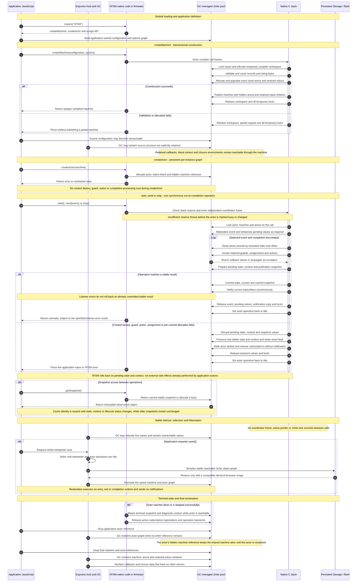

# XFSM Memory Lifetime

This document complements the [memory ownership diagram](memory-ownership.md)
by showing when XFSM memory is created, used, retained, or made eligible for
collection. It is a conceptual lifecycle view rather than a timing diagram.

The sequence below shows when the groups in the companion ownership diagram
are created, used, retained, or made eligible for collection. It describes one
machine and actor; additional actors repeat the per-actor portion while
retaining the same shared machine.

The lifetime boundaries carry several consequences:

- Machine construction is atomic from application JavaScript's perspective.
  A failed `createMachine()` leaves neither an executable partial arena nor a
  published machine object.
- The source definition and compiler workspace may occupy the JsVar pool at the
  same time as the new arena. After successful construction, source structure
  is unnecessary unless the application retains it independently.
- An actor retains its machine, so discarding the application's direct machine
  reference does not release the arena while any actor remains reachable.
- Each public actor operation owns its coordinator frame, arena lock, event,
  pending state, pending context, and publication working values only until the
  synchronous call finishes. A nested call on another actor receives an
  independent frame; a nested call on the same busy actor is rejected.
- Runtime rollback applies to XFSM's pending state and context. It cannot undo
  GPIO changes, output, Storage writes, network activity, or other effects
  already performed by an action.
- Stable snapshots may remain cached between calls. Operation-local events,
  pending values, arena pointers, notification copies, and coordinator frames
  may not.
- GC and `save()` observe only ordinary reachable Espruino objects. Relocation
  is safe because persistent native records contain indexes and offsets rather
  than JavaScript or arena pointers.
