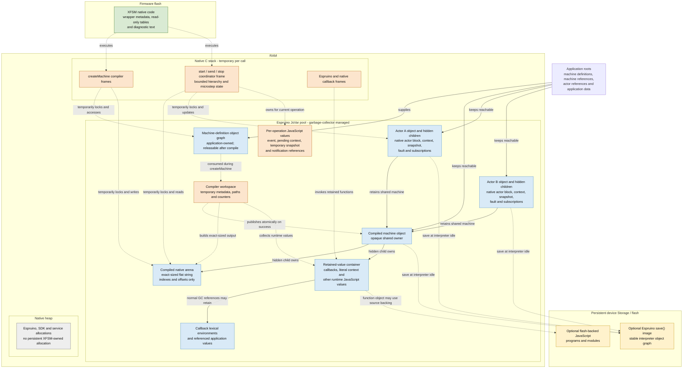

# XFSM Memory Ownership

## Ownership Map

This is a conceptual ownership diagram, not a literal MCU address map. Exact
flash and RAM addresses depend on the target, linker script, Espruino build,
and enabled services.

The companion [memory lifetime diagram](memory-lifetime.md) shows when these
objects and temporary regions are created, used, retained, and released.

Solid arrows describe persistent ownership or reachability. Dashed arrows
describe temporary access, construction, execution, or persistence activity;
they do not represent a native pointer retained after the call returns.

The important ownership rules are:

- The compiled arena contains native records, but its physical storage is an
  Espruino flat string in the GC-managed JsVar pool.
- The machine owns the arena and retained-value container through hidden,
  garbage-collector-visible children. Releasing the last machine or actor
  reference makes that graph eligible for collection.
- Actors retain their shared compiled machine but separately own all changing
  runtime state. Actor A and Actor B therefore share the arena without sharing
  active state, context, snapshots, faults, subscriptions, or operation state.
- Native records refer to JavaScript values by retained-slot index. They never
  retain a `JsVar *`, `JsVarRef`, or pointer into the arena between calls.
- Compiler workspace, coordinator state, locks, pending values, and callback
  frames are temporary. Every success and failure path must release them before
  returning to application JavaScript.
- XFSM has no persistent native-heap allocation or global actor registry.
  Persistent state remains reachable through ordinary Espruino object graphs.
- Retaining a flash-backed callback keeps its JavaScript function value
  reachable but does not copy its source into RAM. Its Storage or module
  backing must remain valid while the machine can invoke it.
- `save()` records a stable interpreter object graph only after Espruino
  returns to idle. It does not persist a live coordinator frame, arena pointer,
  pending state, or partially completed notification.
